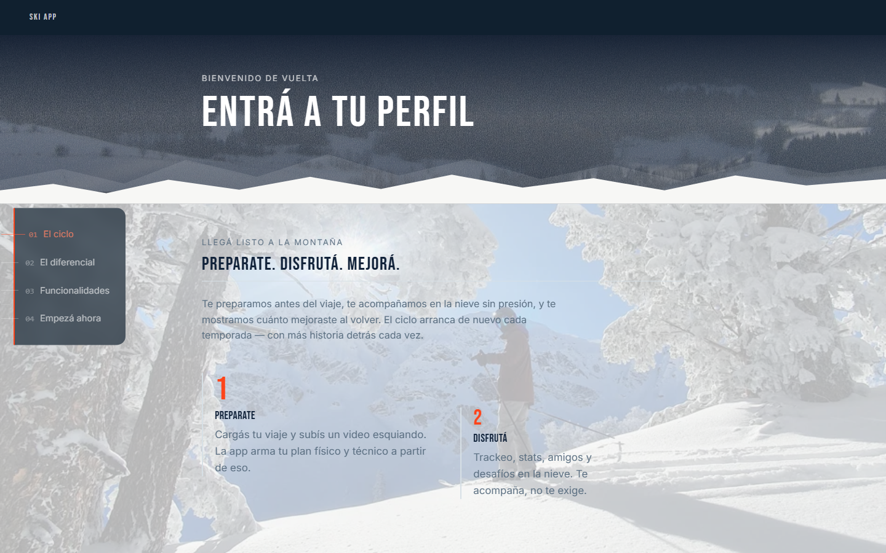
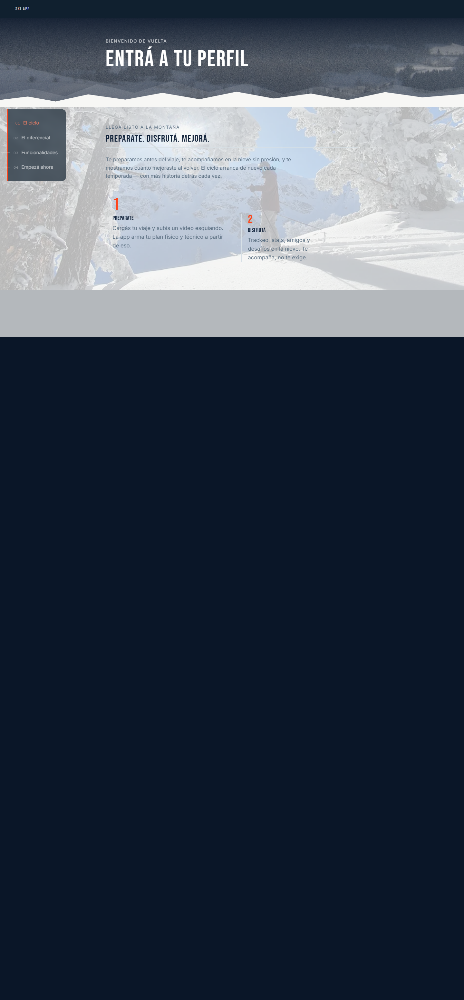

# Baseline — Sprint Hero + transición a PREPARATE

Estado de referencia antes de tocar el Hero de la home y la transición
inmediata hacia "El ciclo / Preparate". Capturado el 2026-09-24, después de
commitear el fix de scroll (`1ecc760`), sobre `master`.

## Capturas

### Mobile (390×844, iPhone, viewport visible)

### Mobile (390×844, página completa)

### Desktop (1440×900, viewport visible)

### Desktop (1440×900, página completa)

## Restricciones para este sprint (Hero + transición a PREPARATE)

1. **NO TOCAR**: sección de Features/funcionalidades, formulario de
   login/registro (más allá de lo ya arreglado), Passport, panel de Admin,
   ni ninguna otra pantalla. Solo Hero + la transición inmediata hacia
   "El ciclo/Preparate".
2. **NO TOCAR** backend, base de datos, ni ningún endpoint — este sprint es
   100% visual/frontend.
3. **NO cambiar** la paleta base (navy/snow/naranja bengala) ni la
   tipografía (Bebas Neue para títulos, Inter/Work Sans para texto).
4. **NO migrar** a React ni cambiar la arquitectura (sigue siendo
   FastAPI + Jinja2 + JS vanilla + anime.js).
5. **NO romper** el fix de `overflow-x: clip` recién aplicado, ni el
   sistema de scroll-reveal existente en las secciones que no se están
   tocando.
6. **NO agregar** WebGL/3D real.
7. **NO exceder** el uso del naranja — sigue reservado solo para acciones
   y logros reales, no decoración.
8. Debe seguir siendo **responsive/mobile-first** — no romper ningún
   breakpoint que ya funcione bien en el resto del sitio.
