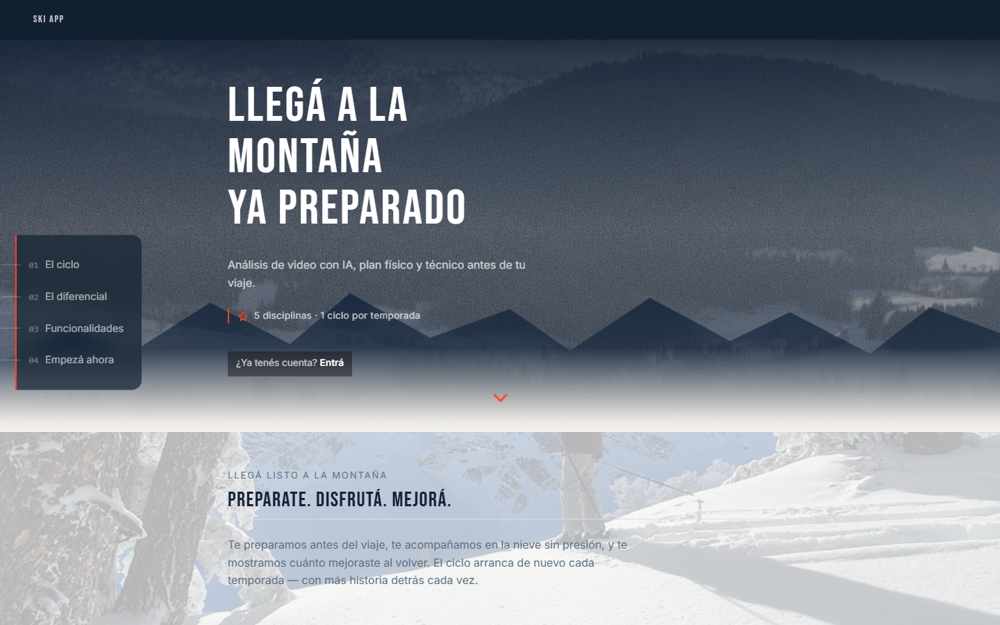

# Cierre de sprint — Hero + transición a "El ciclo/Preparate"

Comparación before/after contra [`docs/baseline.md`](baseline.md). Todas las fases (1: Creative Director/UX, 2: Motion, 2.5: chequeo técnico, 3: Frontend, 4: Visual QA) quedaron aprobadas sin desvíos pendientes — se salta la Fase 5 por no haber nada que corregir.

## Mobile (390×844)

**Antes**

**Después**

## Desktop (1440×900)

**Antes**

**Después**

*(Las versiones full-page de ambos sets — `baseline/*-full.png` y `after/*-full.png` — comparten un artefacto propio de la captura full-page de Playwright con `background-attachment: fixed` en `body` (ya presente en el baseline original, no introducido por este sprint): el documento se corta y repite más abajo. No afecta a usuarios reales, que nunca ven un viewport de ese alto — las comparaciones de arriba usan las capturas de viewport real, que son las que reflejan la experiencia real.)*

## Qué cambió

- Hero: copy de dos líneas con propuesta de valor real ("Llegá a la montaña ya preparado" + qué hace la app) en vez del copy de login ("Bienvenido de vuelta / Entrá a tu perfil") que no comunicaba nada a un visitante nuevo.
- Chip "5 disciplinas · 1 ciclo por temporada" — dato estructural, no de usuario (la ruta no tiene datos reales sin tocar backend, fuera de alcance).
- Atajo "¿Ya tenés cuenta? Entrá" para que un usuario que vuelve no tenga que scrollear todo el flujo de venta para loguearse.
- Indicador de scroll como único CTA protagonista del Hero (naranja, el login se queda donde ya estaba, intacto, en "Empezá ahora").
- Transición Hero → "El ciclo" vía una silueta de montaña propia (`.hero-summit-bridge`), scopeada a home, que "aterriza" del tono oscuro de la foto al blanco de la sección siguiente — reemplaza el zigzag genérico solo en este template, sin tocar `.hero-peaks`/`.hero-ridge` (compartidas con Passport/Register).
- Profundidad de 3 capas: foto (parallax existente, sin tocar) + silueta (parallax nuevo, más rápido, vía mecanismo de velocidad-por-capa aditivo) + texto fijo.

## Bug encontrado y corregido durante el sprint (no relacionado con el pedido original)

De paso, se detectó y arregló el bug real de scroll bloqueado en mobile (`overflow-x: hidden` + `transform` de la animación de entrada = scroll completamente muerto en Chrome/Android) — fix: `overflow-x: clip`. Documentado con más detalle en el historial de la conversación; no forma parte del alcance de Hero/transición pero se corrigió antes de empezar este sprint porque bloqueaba poder trabajar/probar la página.

## Restricciones — verificación final

- Features, login/registro (form), Passport, Admin: sin tocar — reconfirmado con Playwright después de cada fase (`.hero-ridge`/`.hero-peaks` presentes e idénticos en Passport y Register).
- Backend/DB/endpoints: cero cambios, solo `backend/app/templates/index.html` y `backend/app/templates/base_user.html`.
- Paleta y tipografía: sin cambios, solo reutilización de tokens existentes.
- Arquitectura (FastAPI + Jinja2 + JS vanilla + anime.js): sin cambios.
- Fix de `overflow-x: clip` y sistema `.reveal`: verificado que siguen intactos y funcionando (scroll real con wheel y touch confirmado en cada fase).
- WebGL/3D: no se usó.
- Naranja: acotado a 2 usos funcionales (indicador de scroll + ícono del chip), cero decoración.
- Mobile-first / breakpoints existentes: sin romper, verificado overflow horizontal (`scrollWidth = 390`) y performance de scroll (90 frames medidos, prácticamente sin frames largos).
