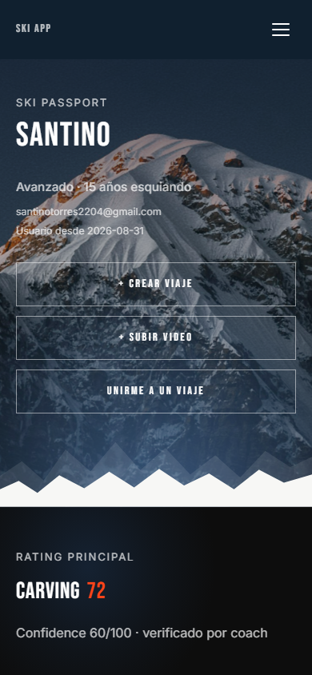
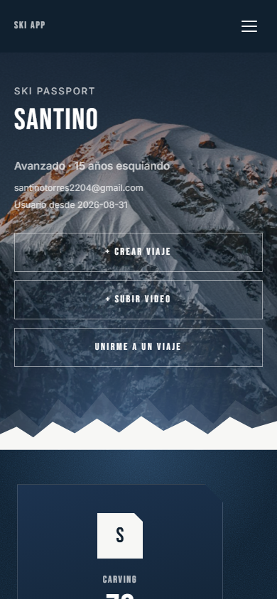
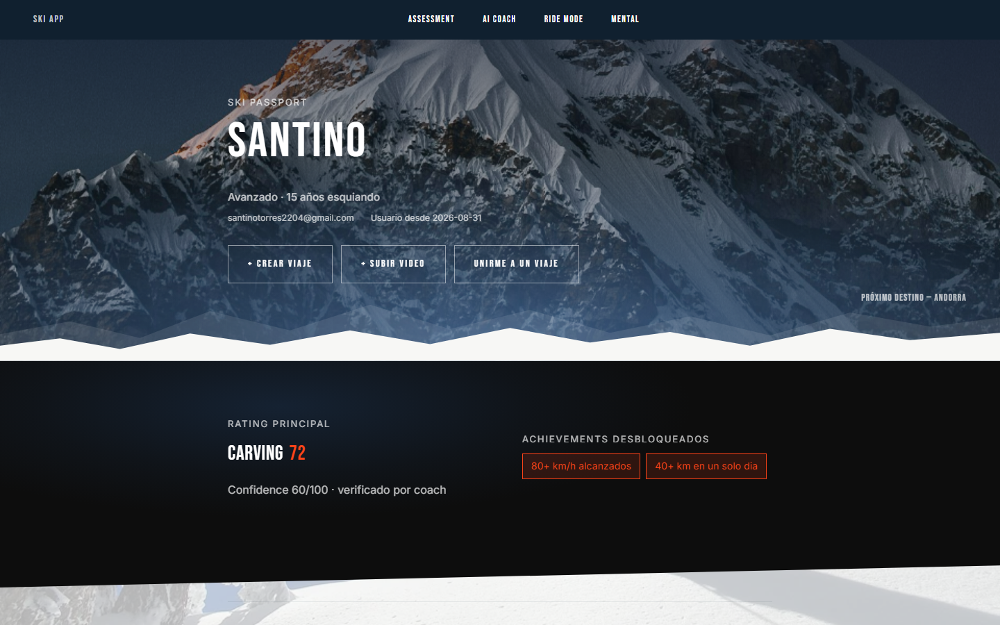
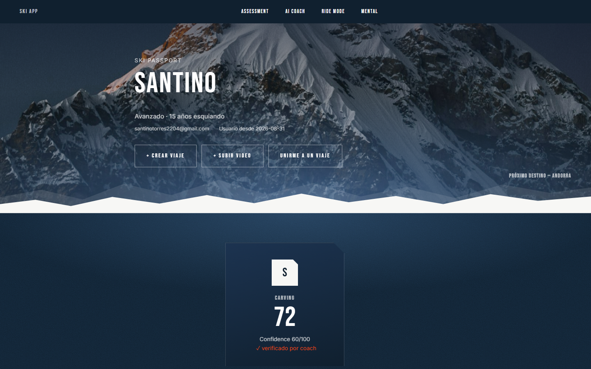
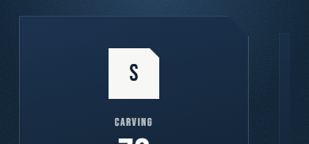
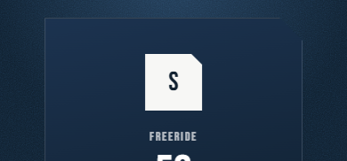

# Cierre de sprint — Passport (reorganización de acordeones + Ski Card multi-disciplina)

Comparación before/after contra [`docs/baseline-passport.md`](baseline-passport.md). Todas las fases (0: baseline, 1: Creative Director/UX incluida la revisión "una carta por disciplina", 2: Motion, 2.5: chequeo técnico, 3: Frontend, 4: Visual QA) quedaron aprobadas — sin desvíos pendientes, se salta la Fase 5.

## Mobile (390×844) — datos reales (1 disciplina cargada)

**Antes**

**Después**

## Desktop (1440×900) — datos reales

**Antes**

**Después**

*(Versiones full-page, acordeones cerrados y abiertos, en `baseline-passport/` y `after-passport/` — mismo artefacto conocido de `background-attachment:fixed` en capturas full-page ya documentado en el cierre del sprint del Hero; neutralizado solo para la captura, no afecta el sitio real.)*

## Evidencia del carrusel multi-disciplina

Los dos usuarios que existen hoy en la base solo tienen **una** disciplina cargada cada uno — con datos reales, el carrusel se degrada correctamente a "una carta, sin UI de navegación" (así se ve arriba). Para dejar evidencia del carrusel completo (que sí es el comportamiento real en cuanto un usuario tenga 2+ ratings), estas capturas usan el template real renderizado con datos de prueba inyectados vía interceptación de red — **no se tocó la base de datos** en ningún momento del sprint.

**Mobile — carta activa (peek a la derecha) y tras deslizar (peek a los dos lados)**

**Desktop — con flechas y puntos**

## Qué cambió

- La Ski Card dejó de ser una fila dentro de un acordeón y pasa a ser el segundo momento fuerte de la página — una carta por disciplina con rating real (sin cartas vacías), ordenadas por score descendente, con monograma tipográfico como avatar (sin foto real, sin upload).
- Giro de entrada propio de la colección (rotateY, dispara una sola vez), no el `.reveal` genérico — deslizar entre cartas no repite el giro, cada carta cuenta sus números la primera vez que se muestra.
- Carrusel con swipe (umbral combinado de distancia + velocidad, rubber-band en los bordes), peek interpolado en tiempo real, puntos y flechas de desktop, navegación por teclado.
- Sheen que sigue al cursor en desktop y barrido único coordinado en mobile, por carta.
- Los 9 acordeones (Ski Card ya no es uno de ellos) se reagrupan en Actividad / Progreso técnico / Preparación + Achievements aparte, con etiqueta y trazo que se dibuja al entrar.

## Bug encontrado y corregido en QA (Fase 4)

El tilt de desktop (gateado a mouse con puntero fino — un dedo real nunca lo dispara) se activaba al pasar el cursor por el sliver visible de una carta no-activa del carrusel, y quedaba pegado a escala completa sin autocorregirse. Medido: el camino más directo hacia la flecha "next" ya cruza ese sliver, así que no era un caso raro — se corrigió con `pointer-events: none` en las cartas no activas (bajo acople, sin tocar el sistema de tilt existente).

## Restricciones — verificación final

- Home, Register, Admin: sin tocar — reconfirmado en cada fase (`hero-login-hint` intacto en home, `hero-ridge`/`hero-peaks` intactos en register, `/admin/videos` sin rastro de `.ski-card`).
- Backend/DB/endpoints: cero cambios — solo `backend/app/templates/passport.html` y `backend/app/templates/base_user.html`. El orden de las cartas se resuelve con el filtro `sort` de Jinja sobre el dato que ya existía.
- Paleta y tipografía: sin tokens nuevos.
- Arquitectura (FastAPI + Jinja2 + JS vanilla + anime.js): sin cambios, sin React, sin WebGL.
- Fix de `overflow-x: clip` y sistema `.reveal`: verificado intacto — validado además que el swipe horizontal del carrusel (bloqueo de dirección + `touch-action: pan-y`) no reabre el bug de scroll, con gestos táctiles reales.
- Sin foto real de usuario, sin upload, sin compartir/comparación social — confirmado en el alcance final.
- Mobile-first: verificado sin overflow horizontal (390px y 1440px) y con 0 frames largos medidos durante scroll con el carrusel presente.
